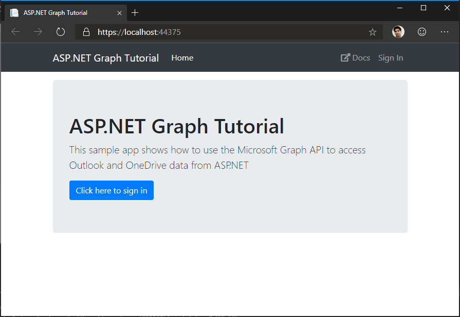

<!-- markdownlint-disable MD002 MD041 -->

Visual Studio を開き、[**ファイル > 新しい > プロジェクト**] を選択します。 [**新しいプロジェクト**] ダイアログボックスで、次の操作を行います。

1. **Visual C# > Web > テンプレート**を選択します。
1. [ **ASP.NET Web アプリケーション (.Net Framework)**] を選択します。
1. プロジェクトの名前については、「グラフを入力してください」**というチュートリアル**を行います。

    ![Visual Studio 2017 [新しいプロジェクトの作成] ダイアログ](./images/vs-new-project-01.png)

    > [!NOTE]
    > これらのラボ手順で指定した Visual Studio プロジェクトに対して、まったく同じ名前を入力してください。 Visual Studio プロジェクト名は、コード内の名前空間の一部になります。 これらの手順内のコードは、この手順で指定した Visual Studio プロジェクト名に一致する名前空間によって決まります。 別のプロジェクト名を使用すると、プロジェクトの作成時に入力した Visual Studio プロジェクト名と一致するようにすべての名前空間を調整しない限り、コードはコンパイルされません。

1. **[OK]** を選択します。 [ **ASP.NET Web アプリケーションプロジェクトの新規作成**] ダイアログボックスで、[ **MVC** ( **ASP.NET 4.7.2 Templates**)] を選択し、[ **OK]** を選択します。

1. **F5**キーを押すか、デバッグ > 選択して**デバッグを開始**します。 すべてが動作している場合は、既定のブラウザーが開き、既定の ASP.NET ページが表示されます。

## <a name="add-nuget-packages"></a>NuGet パッケージを追加する

に進む前に、 `bootstrap` nuget パッケージを更新し、後で使用する追加の nuget パッケージをいくつかインストールします。

- [Owin web](https://www.nuget.org/packages/Microsoft.Owin.Host.SystemWeb/)を使用して、ASP.NET アプリケーションで[Owin](http://owin.org/)インターフェイスを有効にします。
- Owin Azure で OpenID Connect 認証を実行するための[OpenIdConnect](https://www.nuget.org/packages/Microsoft.Owin.Security.OpenIdConnect/) 。
- Cookie ベースの認証を有効にする[Owin](https://www.nuget.org/packages/Microsoft.Owin.Security.Cookies/) 。
- アクセストークンを要求および管理するための[id](https://www.nuget.org/packages/Microsoft.Identity.Client/) 。
- Microsoft Graph に電話をかけるための[グラフ](https://www.nuget.org/packages/Microsoft.Graph/)です。

1. [**ツール > NuGet パッケージマネージャー > パッケージマネージャーコンソール**] を選択します。
1. パッケージマネージャーコンソールで、次のコマンドを入力します。

    ```Powershell
    Update-Package bootstrap
    Install-Package Microsoft.Owin.Host.SystemWeb
    Install-Package Microsoft.Owin.Security.OpenIdConnect
    Install-Package Microsoft.Owin.Security.Cookies
    Install-Package Microsoft.Identity.Client -Version 3.0.8
    Install-Package Microsoft.Graph -Version 1.15.0
    ```

## <a name="design-the-app"></a>アプリを設計する

このセクションでは、アプリケーションの基本的な構造を作成します。

1. 基本的な OWIN startup クラスを作成します。 ソリューションエクスプローラーで`graph-tutorial`フォルダーを右クリックして、[**新しいアイテムの追加 >**] を選択します。 **OWIN Startup クラス**テンプレートを選択し、ファイル`Startup.cs`の名前を指定して、[**追加**] を選択します。

1. ソリューションエクスプローラーで [**モデル**] フォルダーを右クリックし、[ **> クラスの追加**] を選択します。クラス`Alert`の名前を指定して、[**追加**] を選択します。 に`Alert.cs`次のコードを追加します。 このクラスを使用して、アプリのビューでエラーメッセージをフラッシュします。

    ```cs
    namespace graph_tutorial.Models
    {
        public class Alert
        {
            public const string AlertKey = "TempDataAlerts";
            public string Message { get; set; }
            public string Debug { get; set; }
        }
    }
    ```

1. `./Views/Shared/_Layout.cshtml`ファイルを開き、その内容全体を次のコードに置き換えて、アプリのグローバルレイアウトを更新します。

    ```html
    @{
        var alerts = TempData.ContainsKey(graph_tutorial.Models.Alert.AlertKey) ?
            (List<graph_tutorial.Models.Alert>)TempData[graph_tutorial.Models.Alert.AlertKey] :
            new List<graph_tutorial.Models.Alert>();
    }

    <!DOCTYPE html>
    <html>
    <head>
        <meta charset="utf-8" />
        <meta name="viewport" content="width=device-width, initial-scale=1.0">
        <title>ASP.NET Graph Tutorial</title>
        @Styles.Render("~/Content/css")
        @Scripts.Render("~/bundles/modernizr")

        <link rel="stylesheet" href="https://use.fontawesome.com/releases/v5.1.0/css/all.css"
              integrity="sha384-lKuwvrZot6UHsBSfcMvOkWwlCMgc0TaWr+30HWe3a4ltaBwTZhyTEggF5tJv8tbt"
              crossorigin="anonymous">
    </head>

    <body>
        <nav class="navbar navbar-expand-md navbar-dark fixed-top bg-dark">
            <div class="container">
                @Html.ActionLink("ASP.NET Graph Tutorial", "Index", "Home", new { area = "" }, new { @class = "navbar-brand" })
                <button class="navbar-toggler" type="button" data-toggle="collapse" data-target="#navbarCollapse"
                        aria-controls="navbarCollapse" aria-expanded="false" aria-label="Toggle navigation">
                    <span class="navbar-toggler-icon"></span>
                </button>
                <div class="collapse navbar-collapse" id="navbarCollapse">
                    <ul class="navbar-nav mr-auto">
                        <li class="nav-item">
                            @Html.ActionLink("Home", "Index", "Home", new { area = "" },
                                new { @class = ViewBag.Current == "Home" ? "nav-link active" : "nav-link" })
                        </li>
                        @if (Request.IsAuthenticated)
                        {
                            <li class="nav-item" data-turbolinks="false">
                                @Html.ActionLink("Calendar", "Index", "Calendar", new { area = "" },
                                    new { @class = ViewBag.Current == "Calendar" ? "nav-link active" : "nav-link" })
                            </li>
                        }
                    </ul>
                    <ul class="navbar-nav justify-content-end">
                        <li class="nav-item">
                            <a class="nav-link" href="https://developer.microsoft.com/graph/docs/concepts/overview" target="_blank">
                                <i class="fas fa-external-link-alt mr-1"></i>Docs
                            </a>
                        </li>
                        @if (Request.IsAuthenticated)
                        {
                            <li class="nav-item dropdown">
                                <a class="nav-link dropdown-toggle" data-toggle="dropdown" href="#" role="button" aria-haspopup="true" aria-expanded="false">
                                    @if (!string.IsNullOrEmpty(ViewBag.User.Avatar))
                                    {
                                        
                                    }
                                    else
                                    {
                                        <i class="far fa-user-circle fa-lg rounded-circle align-self-center mr-2" style="width: 32px;"></i>
                                    }
                                </a>
                                <div class="dropdown-menu dropdown-menu-right">
                                    <h5 class="dropdown-item-text mb-0">@ViewBag.User.DisplayName</h5>
                                    <p class="dropdown-item-text text-muted mb-0">@ViewBag.User.Email</p>
                                    <div class="dropdown-divider"></div>
                                    @Html.ActionLink("Sign Out", "SignOut", "Account", new { area = "" }, new { @class = "dropdown-item" })
                                </div>
                            </li>
                        }
                        else
                        {
                            <li class="nav-item">
                                @Html.ActionLink("Sign In", "SignIn", "Account", new { area = "" }, new { @class = "nav-link" })
                            </li>
                        }
                    </ul>
                </div>
            </div>
        </nav>
        <main role="main" class="container">
            @foreach (var alert in alerts)
            {
                <div class="alert alert-danger" role="alert">
                    <p class="mb-3">@alert.Message</p>
                    @if (!string.IsNullOrEmpty(alert.Debug))
                    {
                        <pre class="alert-pre border bg-light p-2"><code>@alert.Debug</code></pre>
                    }
                </div>
            }

            @RenderBody()
        </main>
        @Scripts.Render("~/bundles/jquery")
        @Scripts.Render("~/bundles/bootstrap")
        @RenderSection("scripts", required: false)
    </body>
    </html>
    ```

    このコードでは、単純なスタイル設定[](https://fontawesome.com/)のために[ブートストラップ](https://getbootstrap.com/)が追加されています。 また、ナビゲーションバーのあるグローバルレイアウトを定義し、その`Alert`クラスを使用して通知を表示します。

1. を`Content/Site.css`開いて、コンテンツ全体を次のコードに置き換えます。

    ```css
    body {
      padding-top: 4.5rem;
    }

    .alert-pre {
      word-wrap: break-word;
      word-break: break-all;
      white-space: pre-wrap;
    }
    ```

1. `Views/Home/index.cshtml`ファイルを開き、その内容を次のように置き換えます。

    ```html
    @{
        ViewBag.Current = "Home";
    }

    <div class="jumbotron">
        <h1>ASP.NET Graph Tutorial</h1>
        <p class="lead">This sample app shows how to use the Microsoft Graph API to access Outlook and OneDrive data from ASP.NET</p>
        @if (Request.IsAuthenticated)
        {
            <h4>Welcome @ViewBag.User.DisplayName!</h4>
            <p>Use the navigation bar at the top of the page to get started.</p>
        }
        else
        {
            @Html.ActionLink("Click here to sign in", "SignIn", "Account", new { area = "" }, new { @class = "btn btn-primary btn-large" })
        }
    </div>
    ```

1. ソリューションエクスプローラーで [**コントローラー** ] フォルダーを右クリックし、[ **> コントローラーの追加**] を選択します。[ **MVC 5 コントローラー-空**] を選択し、[**追加**] を選択します。 コントローラー `BaseController`の名前を指定して、[**追加**] を選択します。 の内容を以下のコードと置き換えます。

    ```cs
    using graph_tutorial.Models;
    using System.Collections.Generic;
    using System.Web.Mvc;

    namespace graph_tutorial.Controllers
    {
        public abstract class BaseController : Controller
        {
            protected void Flash(string message, string debug=null)
            {
                var alerts = TempData.ContainsKey(Alert.AlertKey) ?
                    (List<Alert>)TempData[Alert.AlertKey] :
                    new List<Alert>();

                alerts.Add(new Alert
                {
                    Message = message,
                    Debug = debug
                });

                TempData[Alert.AlertKey] = alerts;
            }
        }
    }
    ```

    すべてのコントローラーは、この基本コントローラクラスから継承して、 `Flash`関数へのアクセスを取得できます。 継承元`HomeController` `BaseController`のクラスを更新します。

1. を`Controllers/HomeController.cs`開き、 `public class HomeController : Controller`行を次のように変更します。

    ```cs
    public class HomeController : BaseController
    ```

1. すべての変更を保存し、サーバーを再起動します。 この時点で、アプリの外観は大きく異なります。

    
