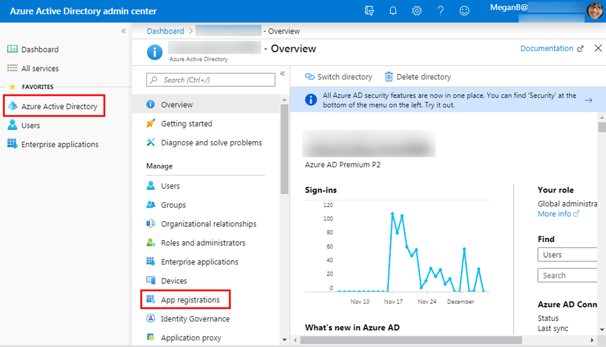

<!-- markdownlint-disable MD002 MD041 -->

この演習では、Azure Active Directory 管理センターを使用して、新しい Azure AD web アプリケーション登録を作成します。In this exercise, you will create a new Azure AD web application registration using the Azure Active Directory admin center.

1. ASP.NET アプリの URL を決定します。Determine your ASP.NET app's URL. Visual Studio のソリューションエクスプローラーで、**グラフ-チュートリアル**プロジェクトを選択します。In Visual Studio's Solution Explorer, select the **graph-tutorial** project. [**プロパティ**] ウィンドウで、**URL** の値を探します。In the **Properties** window, find the value of **URL**. この値をコピーします。Copy this value.

    ![Visual Studio の [プロパティ] ウィンドウのスクリーンショット](./images/vs-project-url.png)

1. ブラウザーを開き、[Azure Active Directory 管理センター](https://aad.portal.azure.com)に移動します。Open a browser and navigate to the [Azure Active Directory admin center](https://aad.portal.azure.com). **個人用アカウント** (別名: Microsoft アカウント)、または**職場/学校アカウント**を使用してログインします。Login using a **personal account** (aka: Microsoft Account) or **Work or School Account**.

1. 左側のナビゲーションで [ **Azure Active Directory** ] を選択し、[**管理**] の下にある [**アプリの登録**] を選択します。Select **Azure Active Directory** in the left-hand navigation, then select **App registrations** under **Manage**.

    

1. **[新規登録]** を選択します。Select **New registration**. **[アプリケーションを登録]** ページで、次のように値を設定します。On the **Register an application** page, set the values as follows.

    - `ASP.NET Graph Tutorial` に **[名前]** を設定します。Set **Name** to `ASP.NET Graph Tutorial`.
    - [**サポートされているアカウントの種類**] を [**任意の組織のディレクトリ内のアカウントと個人用の Microsoft アカウント**] に設定します。Set **Supported account types** to **Accounts in any organizational directory and personal Microsoft accounts**.
    - [**リダイレクト URI**] で、最初のドロップダウン リストを `Web` に設定し、値を手順 1 でコピーした ASP.NET アプリ URL に設定します。Under **Redirect URI**, set the first drop-down to `Web` and set the value to the ASP.NET app URL you copied in step 1.

    ![[アプリケーションの登録] ページのスクリーンショット](./images/aad-register-an-app.png)

1. [**登録**] を選択します。Select **Register**. [ **ASP.NET Graph のチュートリアル**] ページで、**アプリケーション (クライアント) ID**の値をコピーして保存します。次の手順で必要になります。On the **ASP.NET Graph Tutorial** page, copy the value of the **Application (client) ID** and save it, you will need it in the next step.

    

1. [**管理**] の下の [**認証**] を選択します。Select **Authentication** under **Manage**. **[暗黙的な許可]** セクションを検索し、**[ID トークン]** を有効にします。Locate the **Implicit grant** section and enable **ID tokens**. **[保存]** を選択します。Select **Save**.

    

1. **[管理]** で **[証明書とシークレット]** を選択します。Select **Certificates & secrets** under **Manage**. **[新しいクライアント シークレット]** ボタンを選択します。Select the **New client secret** button. [**説明**] に値を入力して、[**有効期限**] のオプションの1つを選択し、[**追加**] を選択します。Enter a value in **Description** and select one of the options for **Expires** and select **Add**.

    ![[クライアントシークレットの追加] ダイアログのスクリーンショット](./images/aad-new-client-secret.png)

1. クライアント シークレットの値をコピーしてから、このページから移動します。Copy the client secret value before you leave this page. 次の手順で行います。You will need it in the next step.

    > [!IMPORTANT]
    > このクライアント シークレットは今後表示されないため、今必ずコピーするようにしてください。This client secret is never shown again, so make sure you copy it now.

    
