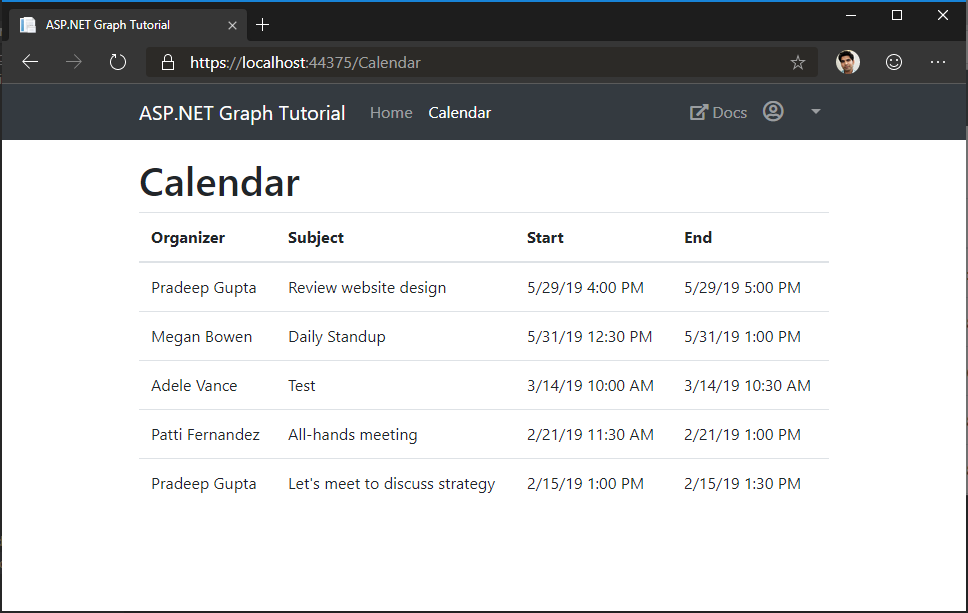

<!-- markdownlint-disable MD002 MD041 -->

<span data-ttu-id="7c111-101">このデモでは、Microsoft Graph をアプリケーションに組み込みます。</span><span class="sxs-lookup"><span data-stu-id="7c111-101">In this demo you will incorporate the Microsoft Graph into the application.</span></span> <span data-ttu-id="7c111-102">このアプリケーションでは、microsoft [Graph クライアントライブラリ](https://github.com/microsoftgraph/msgraph-sdk-dotnet)を使用して microsoft graph を呼び出すことにします。</span><span class="sxs-lookup"><span data-stu-id="7c111-102">For this application, you will use the [Microsoft Graph Client Library for .NET](https://github.com/microsoftgraph/msgraph-sdk-dotnet) to make calls to Microsoft Graph.</span></span>

## <a name="get-calendar-events-from-outlook"></a><span data-ttu-id="7c111-103">Outlook から予定表のイベントを取得する</span><span class="sxs-lookup"><span data-stu-id="7c111-103">Get calendar events from Outlook</span></span>

<span data-ttu-id="7c111-104">まず、最後の`GraphHelper`モジュールで作成したクラスを拡張します。</span><span class="sxs-lookup"><span data-stu-id="7c111-104">Start by extending the `GraphHelper` class you created in the last module.</span></span> <span data-ttu-id="7c111-105">最初に、次`using`のステートメントを`Helpers/GraphHelper.cs`ファイルの先頭に追加します。</span><span class="sxs-lookup"><span data-stu-id="7c111-105">First, add the following `using` statements to the top of the `Helpers/GraphHelper.cs` file.</span></span>

```cs
using graph_tutorial.TokenStorage;
using Microsoft.Identity.Client;
using System.Collections.Generic;
using System.Configuration;
using System.Linq;
using System.Security.Claims;
using System.Web;
```

<span data-ttu-id="7c111-106">その後、次のコードを`GraphHelper`クラスに追加します。</span><span class="sxs-lookup"><span data-stu-id="7c111-106">Then add the following code to the `GraphHelper` class.</span></span>

```cs
// Load configuration settings from PrivateSettings.config
private static string appId = ConfigurationManager.AppSettings["ida:AppId"];
private static string appSecret = ConfigurationManager.AppSettings["ida:AppSecret"];
private static string redirectUri = ConfigurationManager.AppSettings["ida:RedirectUri"];
private static string graphScopes = ConfigurationManager.AppSettings["ida:AppScopes"];

public static async Task<IEnumerable<Event>> GetEventsAsync()
{
    var graphClient = GetAuthenticatedClient();

    var events = await graphClient.Me.Events.Request()
        .Select("subject,organizer,start,end")
        .OrderBy("createdDateTime DESC")
        .GetAsync();

    return events.CurrentPage;
}

private static GraphServiceClient GetAuthenticatedClient()
{
    return new GraphServiceClient(
        new DelegateAuthenticationProvider(
            async (requestMessage) =>
            {
                // Get the signed in user's id and create a token cache
                string signedInUserId = ClaimsPrincipal.Current.FindFirst(ClaimTypes.NameIdentifier).Value;
                SessionTokenStore tokenStore = new SessionTokenStore(signedInUserId,
                    new HttpContextWrapper(HttpContext.Current));

                var idClient = new ConfidentialClientApplication(
                    appId, redirectUri, new ClientCredential(appSecret),
                    tokenStore.GetMsalCacheInstance(), null);

                var accounts = await idClient.GetAccountsAsync();

                // By calling this here, the token can be refreshed
                // if it's expired right before the Graph call is made
                var result = await idClient.AcquireTokenSilentAsync(
                    graphScopes.Split(' '), accounts.FirstOrDefault());

                requestMessage.Headers.Authorization =
                    new AuthenticationHeaderValue("Bearer", result.AccessToken);
            }));
}
```

<span data-ttu-id="7c111-107">このコードの内容を検討してください。</span><span class="sxs-lookup"><span data-stu-id="7c111-107">Consider what this code is doing.</span></span>

- <span data-ttu-id="7c111-108">関数`GetAuthenticatedClient`は、を`GraphServiceClient`呼び出す`AcquireTokenSilentAsync`認証プロバイダーでを初期化します。</span><span class="sxs-lookup"><span data-stu-id="7c111-108">The `GetAuthenticatedClient` function initializes a `GraphServiceClient` with an authentication provider that calls `AcquireTokenSilentAsync`.</span></span>
- <span data-ttu-id="7c111-109">`GetEventsAsync`関数の場合:</span><span class="sxs-lookup"><span data-stu-id="7c111-109">In the `GetEventsAsync` function:</span></span>
  - <span data-ttu-id="7c111-110">呼び出し先の URL は`/v1.0/me/events`になります。</span><span class="sxs-lookup"><span data-stu-id="7c111-110">The URL that will be called is `/v1.0/me/events`.</span></span>
  - <span data-ttu-id="7c111-111">関数`Select`は、各イベントに対して返されるフィールドを、ビューが実際に使用するものだけに制限します。</span><span class="sxs-lookup"><span data-stu-id="7c111-111">The `Select` function limits the fields returned for each events to just those the view will actually use.</span></span>
  - <span data-ttu-id="7c111-112">関数`OrderBy`は、生成された日付と時刻で結果を並べ替えます。最新のアイテムが最初に表示されます。</span><span class="sxs-lookup"><span data-stu-id="7c111-112">The `OrderBy` function sorts the results by the date and time they were created, with the most recent item being first.</span></span>

<span data-ttu-id="7c111-113">ここで、予定表ビュー用のコントローラーを作成します。</span><span class="sxs-lookup"><span data-stu-id="7c111-113">Now create a controller for the calendar views.</span></span> <span data-ttu-id="7c111-114">ソリューションエクスプローラーで [**コントローラー** ] フォルダーを右クリックし、[ **Add > Controller**] を選択します。[ **MVC 5 コントローラー-空**] を選択し、[**追加**] を選択します。</span><span class="sxs-lookup"><span data-stu-id="7c111-114">Right-click the **Controllers** folder in Solution Explorer and choose **Add > Controller...**. Choose **MVC 5 Controller - Empty** and choose **Add**.</span></span> <span data-ttu-id="7c111-115">コントローラー `CalendarController`の名前を指定して、[**追加**] を選択します。</span><span class="sxs-lookup"><span data-stu-id="7c111-115">Name the controller `CalendarController` and choose **Add**.</span></span> <span data-ttu-id="7c111-116">新しいファイルの内容全体を次のコードに置き換えます。</span><span class="sxs-lookup"><span data-stu-id="7c111-116">Replace the entire contents of the new file with the following code.</span></span>

```cs
using graph_tutorial.Helpers;
using System.Threading.Tasks;
using System.Web.Mvc;

namespace graph_tutorial.Controllers
{
    public class CalendarController : BaseController
    {
        // GET: Calendar
        [Authorize]
        public async Task<ActionResult> Index()
        {
            var events = await GraphHelper.GetEventsAsync();
            return Json(events, JsonRequestBehavior.AllowGet);
        }
    }
}
```

<span data-ttu-id="7c111-117">これで、これをテストできます。</span><span class="sxs-lookup"><span data-stu-id="7c111-117">Now you can test this.</span></span> <span data-ttu-id="7c111-118">アプリを起動し、サインインして、ナビゲーションバーの [**予定表**] リンクをクリックします。</span><span class="sxs-lookup"><span data-stu-id="7c111-118">Start the app, sign in, and click the **Calendar** link in the nav bar.</span></span> <span data-ttu-id="7c111-119">すべてが動作する場合は、ユーザーの予定表にイベントの JSON ダンプが表示されます。</span><span class="sxs-lookup"><span data-stu-id="7c111-119">If everything works, you should see a JSON dump of events on the user's calendar.</span></span>

## <a name="display-the-results"></a><span data-ttu-id="7c111-120">結果を表示する</span><span class="sxs-lookup"><span data-stu-id="7c111-120">Display the results</span></span>

<span data-ttu-id="7c111-121">これで、ビューを追加して、よりわかりやすい方法で結果を表示することができます。</span><span class="sxs-lookup"><span data-stu-id="7c111-121">Now you can add a view to display the results in a more user-friendly manner.</span></span> <span data-ttu-id="7c111-122">ソリューションエクスプローラーで、[**ビュー]/[予定表**] フォルダーを右クリックし、[ **Add > View...**] を選択します。ビュー `Index`の名前を指定して、[**追加**] を選択します。</span><span class="sxs-lookup"><span data-stu-id="7c111-122">In Solution Explorer, right-click the **Views/Calendar** folder and choose **Add > View...**. Name the view `Index` and choose **Add**.</span></span> <span data-ttu-id="7c111-123">新しいファイルの内容全体を次のコードに置き換えます。</span><span class="sxs-lookup"><span data-stu-id="7c111-123">Replace the entire contents of the new file with the following code.</span></span>

```html
@model IEnumerable<Microsoft.Graph.Event>

@{
    ViewBag.Current = "Calendar";
}

<h1>Calendar</h1>
<table class="table">
    <thead>
        <tr>
            <th scope="col">Organizer</th>
            <th scope="col">Subject</th>
            <th scope="col">Start</th>
            <th scope="col">End</th>
        </tr>
    </thead>
    <tbody>
        @foreach (var item in Model)
        {
            <tr>
                <td>@item.Organizer.EmailAddress.Name</td>
                <td>@item.Subject</td>
                <td>@Convert.ToDateTime(item.Start.DateTime).ToString("M/d/yy h:mm tt")</td>
                <td>@Convert.ToDateTime(item.End.DateTime).ToString("M/d/yy h:mm tt")</td>
            </tr>
        }
    </tbody>
</table>
```

<span data-ttu-id="7c111-124">これにより、イベントのコレクションをループ処理して、テーブル行を1つずつ追加します。</span><span class="sxs-lookup"><span data-stu-id="7c111-124">That will loop through a collection of events and add a table row for each one.</span></span> <span data-ttu-id="7c111-125">`Index`の`Controllers/CalendarController.cs`関数`return Json(events, JsonRequestBehavior.AllowGet);`から行を削除し、次のコードに置き換えます。</span><span class="sxs-lookup"><span data-stu-id="7c111-125">Remove the `return Json(events, JsonRequestBehavior.AllowGet);` line from the `Index` function in `Controllers/CalendarController.cs`, and replace it with the following code.</span></span>

```cs
return View(events);
```

<span data-ttu-id="7c111-126">アプリを起動し、サインインして、**予定表**のリンクをクリックします。</span><span class="sxs-lookup"><span data-stu-id="7c111-126">Start the app, sign in, and click the **Calendar** link.</span></span> <span data-ttu-id="7c111-127">これで、アプリでイベントの表が表示されるはずです。</span><span class="sxs-lookup"><span data-stu-id="7c111-127">The app should now render a table of events.</span></span>

